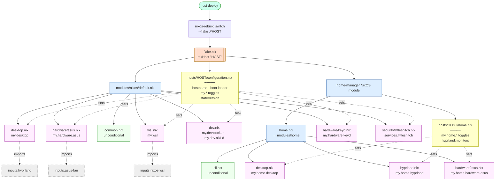

# NixOS Setup

## Repo structure

```
flake.nix                                    # entry point — inputs, mkHost, host registrations
home.nix                                     # shared home-manager base (thin importer)
hosts/<hostname>/configuration.nix           # per-host NixOS switchboard (my.* toggles)
hosts/<hostname>/hardware-configuration.nix  # regenerated per machine via nixos-generate-config
hosts/<hostname>/home.nix                    # per-host home-manager toggles (my.home.*)
modules/nixos/                               # option-gated NixOS modules
modules/home/                                # option-gated home-manager modules
config/                                      # static dotfile sources (hypr, nvim, tmux, zsh, …)
pkgs/                                        # custom callPackage recipes
```

Hosts are **switchboards** — they import `./hardware-configuration.nix`, set
`networking.hostName`, pick a boot loader, and flip `my.*` options. All feature
logic lives in `modules/`.

## Build flow



**Reading it:**
- **Yellow host files** are the only things a new machine has to write. They set `my.*` options and nothing else.
- **Green "unconditional" modules** (`common.nix`, `cli.nix`) load on every host — baseline system + CLI toolbox.
- **Pink "gated" modules** only activate when a host flips their `my.*` toggle. Dashed arrows show which host file drives which gate.
- **Dashed grey upstream imports** (hyprland, asus-fan, nixos-wsl) are pulled in by their feature modules, not globally — so WSL doesn't load hyprland's module and xen doesn't load nixos-wsl's.

## Bootstrap (new machine)

1. Install NixOS (minimal or graphical ISO)
2. Connect to wifi: `nmtui`
3. Enable flakes in `/etc/nixos/configuration.nix`:
   ```nix
   nix.settings.experimental-features = [ "nix-command" "flakes" ];
   ```
4. Set hostname in `/etc/nixos/configuration.nix`:
    ```nix
    networking.hostName = "xen";
    ```
4. Rebuild: `sudo nixos-rebuild switch`
5. Get git temporarily: `nix-shell -p git`
6. Clone this repo:
   ```bash
   git clone <repo-url> ~/dotfiles && cd ~/dotfiles
   ```
7. Regenerate `hardware-configuration.nix` directly from the running hardware (never copy the installer's file or a stale checked-in one — UUIDs and kernel modules drift), then write a thin `configuration.nix` and `home.nix` switchboard (see [Adding a host](#adding-a-host) for the full templates):
   ```bash
   mkdir -p hosts/<hostname>
   sudo nixos-generate-config --show-hardware-config > hosts/<hostname>/hardware-configuration.nix
   $EDITOR hosts/<hostname>/configuration.nix   # my.* toggles + hostname + boot + stateVersion
   $EDITOR hosts/<hostname>/home.nix            # my.home.* toggles
   ```
8. If reinstalling over an old install, wipe leftover partitions so systemd GPT auto-discovery doesn't try to mount them and trigger a UUID wait-job:
   ```bash
   lsblk -f                         # find orphans not in fileSystems
   sudo wipefs -a /dev/<partition>  # for each orphan (old swap, old /home, etc.)
   ```
9. Add a host entry in `flake.nix`:
   ```nix
   nixosConfigurations.<hostname> = mkHost "<hostname>";
   ```
10. Stage all files — flakes only see git-tracked files, unstaged edits are invisible:
    ```bash
    git add -A
    ```
11. Sanity check that the flake actually sees your hardware config (the output must match `hosts/<hostname>/hardware-configuration.nix`):
    ```bash
    nix eval --json .#nixosConfigurations.<hostname>.config.fileSystems
    nix eval --json .#nixosConfigurations.<hostname>.config.boot.initrd.availableKernelModules
    ```
12. Build as `boot` (not `switch`) and reboot — if the new generation breaks, the previous one is still the default entry and you can roll back from the systemd-boot menu:
    ```bash
    sudo nixos-rebuild boot --flake .#<hostname>
    sudo reboot
    ```
13. Once it comes up clean, `nixos-rebuild switch` for subsequent changes.

After this, `/etc/nixos/configuration.nix` is no longer used — the flake owns everything.

## Adding a host

For when the repo is already set up and you want to provision another machine.

1. On the target machine, clone the repo and dump its hardware config:
   ```bash
   git clone <repo-url> ~/dotfiles && cd ~/dotfiles
   mkdir -p hosts/<hostname>
   sudo nixos-generate-config --show-hardware-config > hosts/<hostname>/hardware-configuration.nix
   ```

2. Write `hosts/<hostname>/configuration.nix` as a switchboard. Typical laptop:
   ```nix
   { ... }:
   {
     imports = [ ./hardware-configuration.nix ];

     networking.hostName = "<hostname>";

     boot.loader.systemd-boot.enable = true;
     boot.loader.efi.canTouchEfiVariables = true;

     my.desktop.enable = true;
     my.hardware.keyd.enable = true;
     # my.hardware.asus.enable = true;      # Asus laptops only
     # my.dev.docker.enable = true;
     # my.dev.nixLd.enable = true;
     # services.littlesnitch.enable = true;

     system.stateVersion = "25.11";
   }
   ```

   For WSL: drop `imports`, the boot loader, and every `my.desktop.*` / `my.hardware.*` toggle — `nixos-wsl` handles hardware. Use `my.wsl.enable = true;` instead:
   ```nix
   { ... }:
   {
     networking.hostName = "wsl";
     my.wsl.enable = true;
     system.stateVersion = "25.11";
   }
   ```

3. Write `hosts/<hostname>/home.nix`:
   ```nix
   { ... }:
   {
     my.home.desktop.enable = true;
     my.home.hyprland.enable = true;
     # my.home.hardware.asus.enable = true;

     my.home.hyprland.monitors = ''
       monitor=,preferred,auto,1.0

       xwayland {
         force_zero_scaling = true
       }
     '';
   }
   ```

   For WSL / headless: leave it as `{ ... }: { }` — `modules/home/cli.nix` loads unconditionally, so you still get every CLI tool.

4. Register the host in `flake.nix`:
   ```nix
   nixosConfigurations.<hostname> = mkHost "<hostname>";
   ```

5. Stage (flakes ignore untracked files), preview, build as `boot`, reboot:
   ```bash
   git add -A
   just diff                                        # shows the nvd closure diff
   sudo nixos-rebuild boot --flake .#<hostname>
   sudo reboot
   ```

   After the first clean boot, `just deploy` (or `sudo nixos-rebuild switch`) handles subsequent changes.

## Emergency mode / wait-job on a UUID

If boot hangs on `Timed out waiting for device /dev/disk/by-uuid/<UUID>`:

1. Compare the UUID against `blkid` — if it doesn't exist, find where it's referenced:
   ```bash
   nix eval --json .#nixosConfigurations.<hostname>.config.boot.kernelParams
   nix eval --json .#nixosConfigurations.<hostname>.config.boot.resumeDevice
   nix eval --json .#nixosConfigurations.<hostname>.config.swapDevices
   grep -r <UUID> /boot/loader/entries/    # old generations bake in stale resume=UUID=...
   ```
2. If it's only in old bootloader entries, delete the stale generations and regenerate:
   ```bash
   sudo nix-env --profile /nix/var/nix/profiles/system --delete-generations old
   sudo /run/current-system/bin/switch-to-configuration boot
   ```
3. If nothing in the Nix config references it, it's GPT auto-discovery on an orphan partition — `wipefs` it (see Bootstrap step 8).

## Daily usage

Edit config, then apply:

```bash
git add -A
sudo nixos-rebuild switch --flake .#<hostname>
```

## Updating packages

```bash
nix flake update
sudo nixos-rebuild switch --flake .#<hostname>
```

## Garbage collection

```bash
nix-collect-garbage --delete-older-than 30d
nix-store --optimise
```
