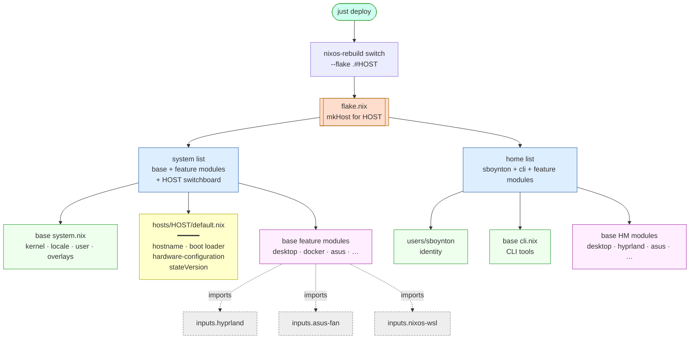

# NixOS Setup

This config uses the [dendritic pattern](https://renatogarcia.blog.br/posts/a-simple-nix-dendritic-config.html):
every `.nix` file under `modules/` declares one or more reusable modules via
`flake.modules.<class>.<name>`, and `flake.nix` composes them into hosts.

## Repo structure

```
flake.nix                                    # entry point — inputs, host composition
modules/base/                                # reusable feature modules
  system.nix                                 #   flake.modules.nixos.base (OS baseline)
  cli.nix                                    #   flake.modules.homeManager.cli
  desktop.nix                                #   nixos.desktop + homeManager.desktop
  dev.nix                                    #   nixos.docker + nixos.nix-ld
  hyprland.nix                               #   flake.modules.homeManager.hyprland
  wsl.nix                                    #   flake.modules.nixos.wsl
  hardware/{asus,keyd}.nix
  security/littlesnitch.nix
modules/hosts/<hostname>/
  default.nix                                # flake.modules.nixos.<hostname> (host switchboard)
  hardware-configuration.nix                 # regenerated via nixos-generate-config
modules/users/<user>/default.nix             # flake.modules.homeManager.<user> (identity)
config/                                      # static dotfile sources (hypr, nvim, tmux, zsh, …)
pkgs/                                        # custom callPackage recipes
```

Every `.nix` under `modules/` is auto-discovered by
[`import-tree`](https://github.com/vic/import-tree) — drop a new file in and
its `flake.modules.*` declarations are available on next rebuild. `hardware-configuration.nix`
files are filtered out of the tree (they're plain NixOS modules, not flake-parts modules)
and are imported by their host's `default.nix` directly.

Modules have a **class** (`nixos`, `homeManager`, later `darwin`) and a **name**.
One file can declare multiple classes — `desktop.nix` declares both
`flake.modules.nixos.desktop` (system-level: portal, hyprland service, audio)
and `flake.modules.homeManager.desktop` (user-level: GUI apps, theming). When
a host imports `desktop` for nixos, it also imports `desktop` for homeManager —
no platform subdirs needed.

## Composition in flake.nix

Hosts are **composed**, not gated. `flake.nix` lists the modules each host
gets; unlisted modules are never evaluated.

```nix
xen = mkHost {
  system = with config.flake.modules.nixos; [
    base desktop docker nix-ld asus keyd littlesnitch xen
  ];
  home = with config.flake.modules.homeManager; [
    sboynton cli desktop hyprland asus
  ];
};

"Sam-Desktop" = mkHost {
  system = with config.flake.modules.nixos; [ base wsl ]
    ++ [ config.flake.modules.nixos."Sam-Desktop" ];
  home = with config.flake.modules.homeManager; [ sboynton cli ];
};
```

`mkHost` feeds the `system` list as nixos modules and pulls `home` into
`home-manager.users.sboynton.imports`. The host's own `flake.modules.nixos.<hostname>`
(e.g. `xen`) is just another module in the list — it sets `networking.hostName`,
boot loader, hardware-configuration.nix import, and any HM customizations
specific to that machine (like `my.home.hyprland.monitors`).

## Build flow



**Reading it:**
- **Yellow host file** is the only thing a new machine has to write. It declares
  `flake.modules.nixos.<hostname>` with hostname, boot loader, hardware import,
  and any HM customization.
- **Green "always" modules** (`base system`, `cli`, user identity) are in every host's list.
- **Pink feature modules** are included per-host in `flake.nix` — WSL doesn't get
  hyprland, xen doesn't get nixos-wsl.
- **Dashed grey upstream imports** (hyprland, asus-fan, nixos-wsl) are pulled in
  by their feature modules, so unused inputs don't evaluate.

## Bootstrap (new machine)

1. Install NixOS (minimal or graphical ISO)
2. Connect to wifi: `nmtui`
3. Enable flakes in `/etc/nixos/configuration.nix`:
   ```nix
   nix.settings.experimental-features = [ "nix-command" "flakes" ];
   ```
4. Set hostname in `/etc/nixos/configuration.nix`:
    ```nix
    networking.hostName = "<hostname>";
    ```
5. Rebuild: `sudo nixos-rebuild switch`
6. Get git temporarily: `nix-shell -p git`
7. Clone this repo:
   ```bash
   git clone <repo-url> ~/dotfiles && cd ~/dotfiles
   ```
8. Dump hardware config directly from running hardware (never copy the installer's file or a stale checked-in one — UUIDs and kernel modules drift):
   ```bash
   mkdir -p modules/hosts/<hostname>
   sudo nixos-generate-config --show-hardware-config > modules/hosts/<hostname>/hardware-configuration.nix
   $EDITOR modules/hosts/<hostname>/default.nix   # see "Adding a host" for template
   ```
9. If reinstalling over an old install, wipe leftover partitions so systemd GPT auto-discovery doesn't try to mount them and trigger a UUID wait-job:
   ```bash
   lsblk -f                         # find orphans not in fileSystems
   sudo wipefs -a /dev/<partition>  # for each orphan (old swap, old /home, etc.)
   ```
10. Register the host in `flake.nix` (see "Adding a host" for syntax).
11. Stage all files — flakes only see git-tracked files, unstaged edits are invisible:
    ```bash
    git add -A
    ```
12. Sanity check the flake sees the hardware config:
    ```bash
    nix eval --json .#nixosConfigurations.<hostname>.config.fileSystems
    nix eval --json .#nixosConfigurations.<hostname>.config.boot.initrd.availableKernelModules
    ```
13. Build as `boot` (not `switch`) and reboot — if the new generation breaks, the previous one is still the default entry and you can roll back from the systemd-boot menu:
    ```bash
    sudo nixos-rebuild boot --flake .#<hostname>
    sudo reboot
    ```
14. Once it comes up clean, `nixos-rebuild switch` for subsequent changes.

After this, `/etc/nixos/configuration.nix` is no longer used — the flake owns everything.

## Adding a host

For when the repo is already set up and you want to provision another machine.

1. On the target machine, clone the repo and dump its hardware config:
   ```bash
   git clone <repo-url> ~/dotfiles && cd ~/dotfiles
   mkdir -p modules/hosts/<hostname>
   sudo nixos-generate-config --show-hardware-config > modules/hosts/<hostname>/hardware-configuration.nix
   ```

2. Write `modules/hosts/<hostname>/default.nix`. Typical laptop:
   ```nix
   {
     flake.modules.nixos.<hostname> = {
       imports = [ ./hardware-configuration.nix ];

       networking.hostName = "<hostname>";
       nixpkgs.hostPlatform = "x86_64-linux";

       boot.loader.systemd-boot.enable = true;
       boot.loader.efi.canTouchEfiVariables = true;

       system.stateVersion = "25.11";
     };
   }
   ```

   For WSL: drop the hardware-configuration import and boot loader (`nixos-wsl` handles both):
   ```nix
   {
     flake.modules.nixos.<hostname> = {
       networking.hostName = "<hostname>";
       nixpkgs.hostPlatform = "x86_64-linux";
       system.stateVersion = "25.11";
     };
   }
   ```

3. Register and compose in `flake.nix`:
   ```nix
   <hostname> = mkHost {
     system = with config.flake.modules.nixos; [
       base desktop keyd      # pick the features this host needs
       <hostname>             # the host's own module
     ];
     home = with config.flake.modules.homeManager; [
       sboynton cli desktop hyprland
     ];
   };
   ```

   For WSL / headless, keep `system = [ base wsl <hostname> ]; home = [ sboynton cli ];`.

4. If this machine needs a hyprland monitor override or other per-host HM tweak,
   add it to the host's `default.nix`:
   ```nix
   home-manager.users.sboynton.my.home.hyprland.monitors = ''
     monitor=,preferred,auto,1.5

     xwayland {
       force_zero_scaling = true
     }
   '';
   ```

5. Stage (flakes ignore untracked files), preview, build as `boot`, reboot:
   ```bash
   git add -A
   just diff                                        # shows the nvd closure diff
   sudo nixos-rebuild boot --flake .#<hostname>
   sudo reboot
   ```

   After the first clean boot, `just deploy` (or `sudo nixos-rebuild switch`) handles subsequent changes.

## Adding a feature module

1. Create `modules/base/<feature>.nix` (or `modules/base/<category>/<feature>.nix`).
2. Declare one or more module classes:
   ```nix
   { inputs, ... }:   # optional — only if the module uses flake inputs
   {
     flake.modules.nixos.<feature> = { pkgs, lib, ... }: {
       # system-level config
     };

     flake.modules.homeManager.<feature> = { pkgs, ... }: {
       # home-manager config
     };
   }
   ```
3. Add `<feature>` to the relevant host's `system` / `home` list in `flake.nix`.

No `my.*.enable` toggles — if a module is in a host's list, it's on; if not, it's never evaluated.

## Emergency mode / wait-job on a UUID

If boot hangs on `Timed out waiting for device /dev/disk/by-uuid/<UUID>`:

1. Compare the UUID against `blkid` — if it doesn't exist, find where it's referenced:
   ```bash
   nix eval --json .#nixosConfigurations.<hostname>.config.boot.kernelParams
   nix eval --json .#nixosConfigurations.<hostname>.config.boot.resumeDevice
   nix eval --json .#nixosConfigurations.<hostname>.config.swapDevices
   grep -r <UUID> /boot/loader/entries/    # old generations bake in stale resume=UUID=...
   ```
2. If it's only in old bootloader entries, delete the stale generations and regenerate:
   ```bash
   sudo nix-env --profile /nix/var/nix/profiles/system --delete-generations old
   sudo /run/current-system/bin/switch-to-configuration boot
   ```
3. If nothing in the Nix config references it, it's GPT auto-discovery on an orphan partition — `wipefs` it (see Bootstrap step 9).

## Daily usage

Edit config, then apply:

```bash
git add -A
sudo nixos-rebuild switch --flake .#<hostname>
```

## Updating packages

```bash
nix flake update
sudo nixos-rebuild switch --flake .#<hostname>
```

## Garbage collection

```bash
nix-collect-garbage --delete-older-than 30d
nix-store --optimise
```
